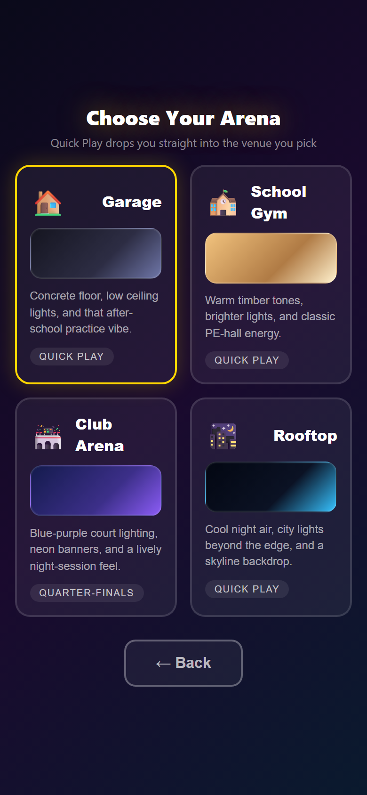
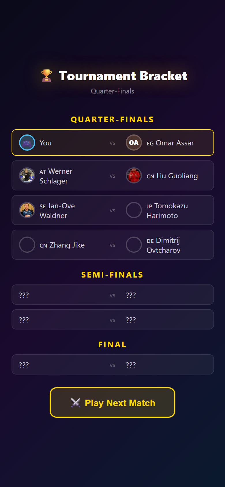
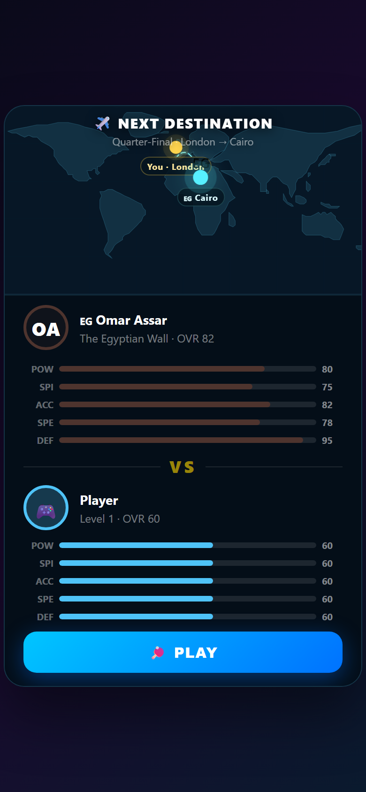
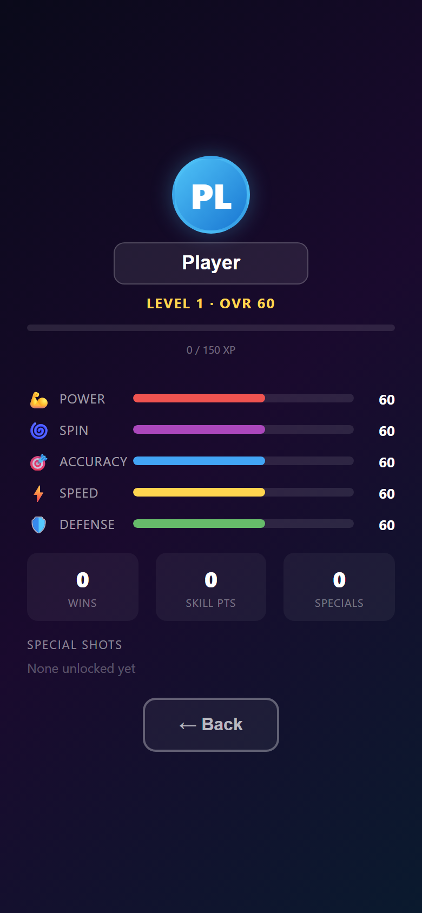
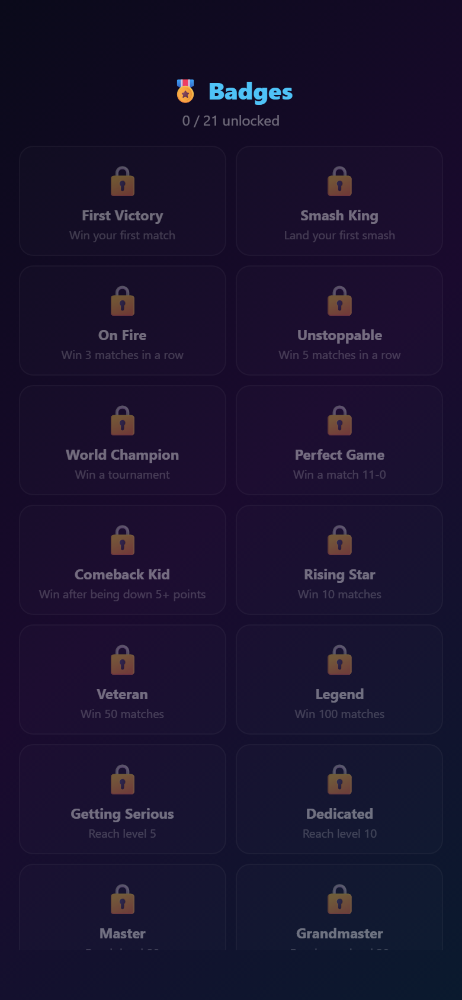
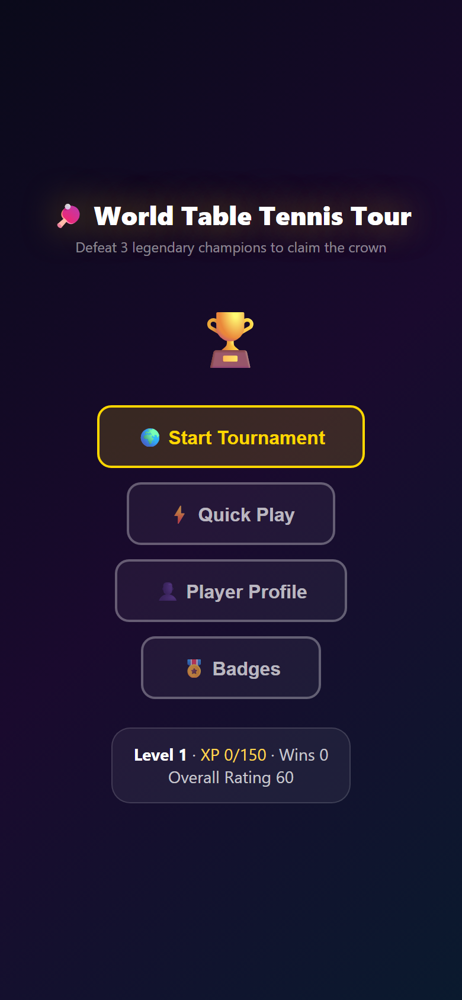

# 🏓 Octo Pong

A 3D table tennis game built with **Three.js** — entirely in a single HTML file. Mobile-first touch controls, realistic physics, AI opponents, tournament mode, and RPG progression.

**[▶ Play Now](https://softchris.github.io/octo-pong/)**

---

## ✨ Features

### 🎮 Realistic Gameplay
- **3rd-person camera** with forehand/backhand detection based on racket position
- **Topspin & backspin** selection with swing-speed-based power
- **Smash system** — auto-detects high balls, enters slow-mo, lets you aim your smash
- **Semi-circular racket swing** animations with trail effects
- **Synthesized audio** — paddle hits, table bounces, serves, and victory fanfare



### 🌍 World Tournament
Defeat 3 legendary champions across the globe to claim the World Championship title. Travel between cities on an animated world map with accurate continent outlines.

- **19 historical champions** — Ma Long, Fan Zhendong, Jan-Ove Waldner, Timo Boll, and more
- **8-player bracket** — Quarter-finals → Semi-finals → Final
- **6 unique arenas** — Garage, Gym, Club, Rooftop, Stadium, World Finals





### 📈 RPG Progression
Level up, earn XP, allocate stat points, and unlock special shots as you win matches.

- **5 stats** — Power, Spin, Accuracy, Speed, Defense
- **10 special shots** — Rocket Serve, Super Loop, Phantom Drop, Dragon Strike, and more
- **30 levels** with stat point allocation
- **21 badges/achievements** — First Victory, Smash King, World Champion, Perfect Game...





### 📱 Mobile-First Design
Built for phones — all controls are touch-based with compact UI that doesn't crowd the screen.

- **Swipe to move** racket — speed determines shot power
- **Tap to serve**
- **Bottom bar** for spin selection
- **Slow-mo smash prompt** with tap-to-aim targeting



### ⚙️ Game Menu
Pause anytime with ESC or the menu button. Access player profile, badges, controls help, and more.


---

## 🚀 Getting Started

No build step needed — it's a single `index.html` file.

```bash
# Clone and serve locally
git clone https://github.com/softchris/octo-pong.git
cd octo-pong
python -m http.server 9090

# Open http://localhost:9090
```

Or just visit **[softchris.github.io/octo-pong](https://softchris.github.io/octo-pong/)**.

## 🛠 Tech Stack

- **Three.js** — 3D rendering (loaded via CDN)
- **Web Audio API** — all sounds synthesized, no audio files
- **Vanilla JS** — no frameworks, no build tools
- **localStorage** — player progress persistence

## 📄 License

MIT

---

*Built with ❤️ and GitHub Copilot 🤖*
